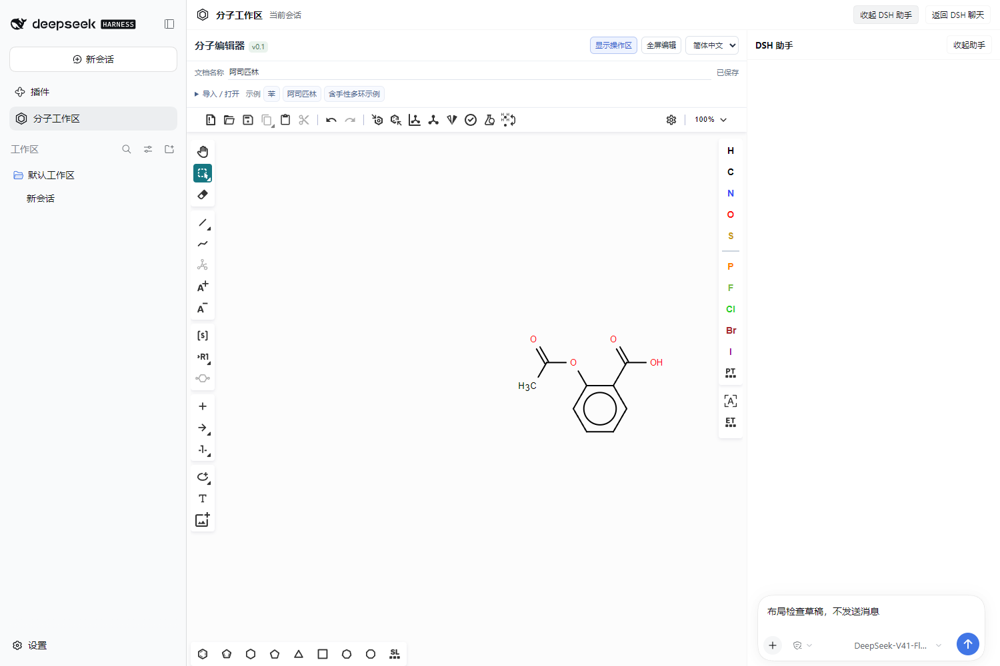

<p align="center">
  
</p>

# 在 DSH 中编辑分子

**dsh-chem-editor** 是 [DeepSeek Harness](https://github.com/deepseek-ai/deepseek-harness) 的分子编辑器插件。用鼠标选中原子、键或片段，写下修改要求，由当前会话的 Agent 生成局部修改预览，再由你应用或取消。

[English](./README.en.md) · [安装](#安装) · [第一次使用](#第一次使用) · [当前范围](#当前范围) · [验证记录](./P3_ACCEPTANCE.md)



<sub>官方 DSH 0.2.0-rc.2 Web 环境截图：真实 Ketcher / Indigo 编辑器与原生 DSH 聊天组件，本次布局检查未调用模型。[主工作区验收记录](./WORKSPACE_ACCEPTANCE.md)。</sub>

## 能做什么

| 操作 | 如何选择 | 批注示例 |
| --- | --- | --- |
| 改元素 | 一个普通原子 | 把选中的 C 换成 N |
| 改键级 | 一根普通键 | 把这根单键改成双键 |
| 添加基团 | 单选原子，或框选后指定连接原子 | 在这里加一个丙基 |
| 替换末端片段 | 连通选区，只有一个普通单键出口 | 把甲基换为苯基 |
| 复合修改 | 满足每一步要求的冻结选区 | 把 O 换成 C，然后接一个苯环 |
| 删除局部 | 原子、键或矩形框选区域 | 删除整个选区，保留其余原子 |

添加和末端替换支持 **OH、CH3、NH2、F、Cl、乙基、正丙基、异丙基、苯基**，每个模板只有一个连接点。“丙基”默认正丙基，预览明确显示名称；仅写 `C3H7` 需要澄清异构体。多原子模板一次添加完整片段，一步撤销。改键支持单键、双键、三键。删除预览会列出被断开的边界键。

此外支持二维手绘、SMILES / MOL / KET 导入、项目文档 / KET / MOL V3000 / SMILES / SVG 导出、自动保存和会话隔离。界面默认简体中文，可切换 English；化学符号、输入内容和结构文件保持原样，部分专业诊断保留英文。

## 安装

当前版本 **0.1.0**。已验证环境为官方 DSH **0.2.0-rc.2**、Node.js **24.14.0**、pnpm **12.6.0**；Ketcher core/react/standalone 锁定 **3.7.0**。其他 DSH 版本尚未验证。

先安装 Node.js、pnpm 和官方 DSH，然后克隆并构建：

```powershell
git clone https://github.com/A7m0spHere/dsh-chem-editor.git
cd dsh-chem-editor
pnpm install --frozen-lockfile
pnpm run build
```

在此项目目录执行桌面端安装。将 `$dshCli` 改为你的 DSH 安装路径：

```powershell
$env:DSH_HOME = Join-Path $env:USERPROFILE '.dsh'
$dshCli = 'D:\dsh\resources\runtime\cli\bin\dsh.cmd'
& $dshCli plugin --profile desktop add (Get-Location).Path
```

通过 DSH 的「应用 → 退出」完整退出，再重新启动，以加载插件宿主和工具。桌面端使用 `desktop` profile。源码安装链接到本地目录，请保留该目录。

仓库保存源码和锁文件；`lib/`、`dist/` 由构建生成。需要本地插件包时运行 `pnpm pack`，会自动构建并打包运行资源。当前没有发布 npm 包或 GitHub Release 安装包。

## 第一次使用

1. 打开 DSH 会话，点击左侧「分子工作区」或会话标题旁的六边形「分子」按钮，进入分子主工作区。
2. 点击「苯」示例，保持矩形选择工具，点击苯环上的一个顶点。
3. 等待状态显示「已保存」，输入“把选中的 C 换成 N”，点击「交给 Agent」。会话需要已配置可用模型。
4. 核对修改前后预览，点击「应用修改」得到吡啶，或点击「取消批注」保留原结构。
5. 点击「撤销」恢复原分子；手工编辑和 Agent 修改使用同一套撤销历史。

「替换选中原子」可以直接做手工元素替换，无需调用模型。批注快捷按钮只填写要求，仍需点击「交给 Agent」。改键时选择一根键。添加基团可以单选一个原子，也可以框选后在批注区指定「添加基团的连接原子」；连接点随批注一起冻结，后续改选不会改变它。删除时可以框选多个原子和键。

画布是主界面，DSH 交互作为辅助。「DSH 助手」按需展开当前会话的原生聊天界面，收起时保留草稿；窄窗口中助手以抽屉显示。默认收起局部操作区，选中原子或键后自动展开，Agent 预览到达时也会显示。

导入、保存与恢复、快捷批注可以按需展开。拖动画布与操作区之间的分隔条或使用方向键可调整大小；「专注绘图」收起操作区，「全屏编辑」扩展编辑器。切换辅助面板保留结构、选区和撤销历史。「返回 DSH 聊天」退出分子工作区，未保存时会先触发保存并保留当前界面，保存完成后再次点击返回；重新进入会从存档恢复结构。

## 修改如何受控

提交时冻结选区和文档版本。Agent 先用 `chem_get_context` 读取对应上下文，再用 `chem_propose_edit` 提交一个局部操作；执行器基于冻结 KET 生成候选，并检查价态、立体信息和修改范围。

工具参数、Agent 上下文、提示词和快捷批注使用同一份基团注册表。添加时检查整个新片段的空间，不移动原有原子。遇到不支持的基团、缺连接点或要求有歧义时，Agent 使用 `chem_reject_edit` 将具体原因和下一步写入面板；执行器错误也会保留，不再统一显示成“未生成预览”。

明确的修改要求会与操作计划核对，不能把丙基擅自换成甲基，也不能把“换原子再接苯环”只做前半段。复合要求通过 `batch.edits` 一次提交 2–8 步，完整验证后显示一个预览，全部一起应用和保存，一步撤销。无法核对完整意图时先澄清；只有你明确改了要求，才接受新的目标或部分方案。

待澄清批注保留原选区。可以直接在 DSH 聊天补充（Agent 使用 `chem_continue_edit`），也可以在面板「补充修改要求」后点击「继续批注」。聊天续接核对实际收到的用户原文，不能由 Agent 伪造确认。结构已变化、编辑器关闭、批注已取消或应用时不能续接，需重新选择提交。

**预览期间原画布保持不变，只有你点击「应用修改」才会保存。** 之后选择其他位置不会改变旧批注的目标；结构发生变化、关闭编辑器或重启后，旧预览失效。模型不能通过工具提交整图 SMILES 来覆盖分子。每个会话同时处理一条批注。

## 保存与恢复

结构、文档名称和语言自动保存；显示「已保存」后，关闭重开面板、刷新或重启 DSH 可以恢复。每个会话拥有独立文档。「项目文档」导出生成 `.chem.json`，可带到另一个会话导入。

保存失败会保留原文件并显示未保存状态；发生版本冲突时，可以先导出当前结构，再「重新载入已保存版本」。撤销历史只在当前编辑器运行期间保留。

从左侧导航直接切走也会补存最新草稿；重新进入会等待尚未结束的保存。补存失败的草稿保留在当前客户端内，返回工作区时恢复，并继续按原版本令牌检查冲突。

<details>
<summary>存储位置与技术信息</summary>

有工作区的会话保存到 `.chem-editor/<会话标识的 SHA-256>.json`；无工作区会话使用 DSH 用户目录下的 `chem-editor/documents`。同目录的 `.annotations.json` 保留最近 20 条批注。文档使用临时文件、flush、替换和内容版本检查；应用回执随文档保存，用于防止重复提交。

Ketcher 在独立 iframe 中运行，隔离 React 和 CSS。静态资源服务只绑定 `127.0.0.1`，随插件宿主卸载关闭；Indigo 在浏览器内运行，无需另起 Python 或 Indigo Server。界面偏好不替代磁盘文档。

</details>

## 当前范围

AI 局部编辑面向普通小分子。末端替换限一个普通非立体单键出口，不能替换原有芳香体系或多出口片段；一般片段替换、自由重连、S-group / R-group、查询或伪原子、反应及聚合物模板仍不支持。复合步骤只引用原冻结选区中仍存在的目标，不能引用上一部新建片段的内部原子。

改芳香环键级、断开芳香体系、影响邻接立体中心的拓扑操作会被拒绝。重叠坐标无法可靠核对时也会拒绝。未修改区域的元素、连接、坐标、电荷、同位素和立体字段受检查；连接边界的隐式氢允许重新计算。

原结构已有且未变化的立体诊断会在预览中显示；新出现的诊断会拒绝。通过结构检查不代表能够合成，也不表示名称与分子身份已核实。

**验证状态：** P0–P3 浏览器回归和真实官方 Web Agent 链路均通过；P0–P2 另有原生 Desktop 验收。P3 已更新到桌面端并完整重启，但最后一次原生窗口点击复验受 Windows 输入保护阻止，尚未完成。详见 [P3 验收记录](./P3_ACCEPTANCE.md)。

2026-10-07 的完整批注修复已通过 20 项单元测试、六组浏览器验收和真实官方 Web Agent 的苯基添加/替换、复合计划、真实聊天续接验证，详见 [完整修改验收](./EDIT_FLOW_ACCEPTANCE.md)。Desktop 链接目录的构建已更新，本轮尚未重启 Desktop 或验证新增能力的原生窗口操作；完整退出后重新打开可加载新工具。

## 开发与验证

```powershell
pnpm test
pnpm run test:browser
```

浏览器验收需要已安装 Chrome。脚本自动启动隔离服务器并清理临时工作区；P0、P1、P2、P3、完整修改/续接和响应布局六组均以 `ALL-PASS` 为通过判据。布局检查覆盖窄面板、宽窗口、分隔条、专注绘图和 iframe 全屏。单元测试还覆盖完整意图、复合提交、单出口替换和真实用户补充的续接。

真实模型测试需要另行启动已配置模型的官方 DSH 临时 Web profile，并从本地忽略的日志读取启动 URL；普通测试不会调用你的模型。未配置真实运行环境时，不直接运行 `scripts/*-real-agent-test.mjs`。`fragment-real-agent-test.mjs` 验证正/异丙基和不支持基团反馈；`complete-edit-real-agent-test.mjs` 验证苯基添加、甲基替换、复合计划和真实聊天续接。

- [P0 技术验证](./P0_ACCEPTANCE.md) · [P1 保存与中文界面](./P1_ACCEPTANCE.md) · [P2 Agent 闭环](./P2_ACCEPTANCE.md) · [P3 四类局部操作](./P3_ACCEPTANCE.md)
- [开发方案与后续计划](./DEVELOPMENT_PLAN.md)：P4 将另行确定多出口片段替换、多条批注等范围。
- [报告问题](https://github.com/A7m0spHere/dsh-chem-editor/issues)：请提供 DSH 版本、操作步骤和可分享的最小结构样例；不要附带凭据或认证 URL。

## 许可与致谢

本项目代码采用 [MIT 许可证](./LICENSE)。[EPAM Ketcher](https://github.com/epam/ketcher) 与 [Indigo](https://github.com/epam/Indigo) 使用 Apache-2.0；其他依赖遵循各自许可证。第三方许可声明随构建保留。
